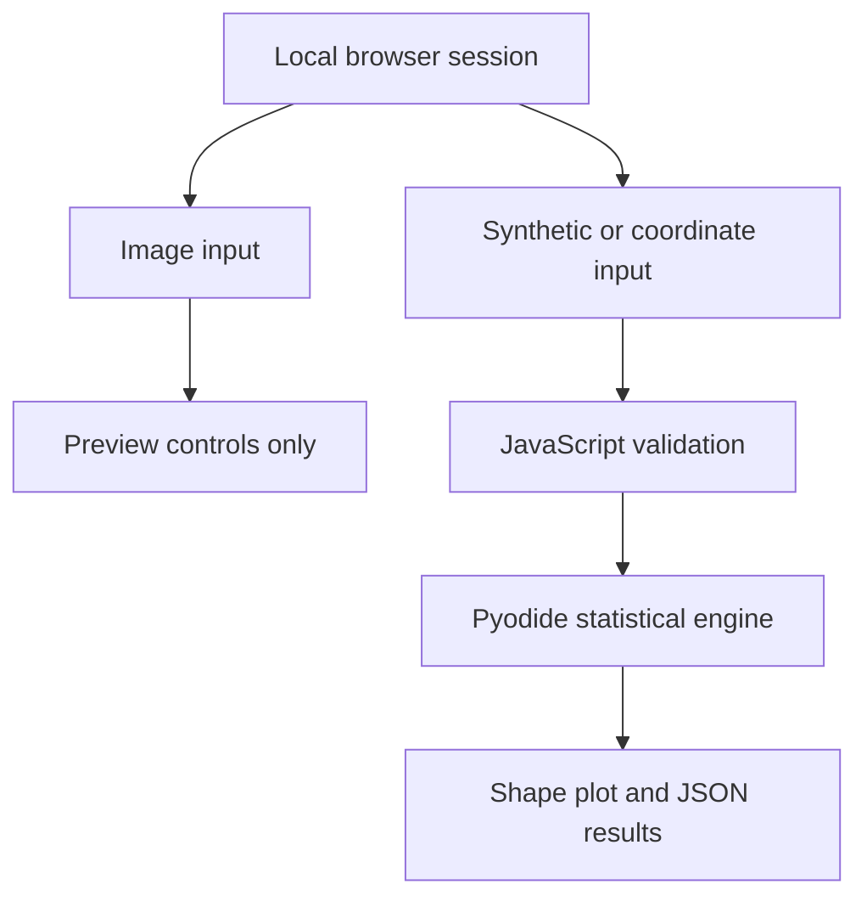

# bio-social-aesthetic-manifold

A serverless, browser-based demonstration of descriptive geometric
morphometrics. The application uses iterative Generalized Procrustes Analysis
(GPA), a 132-dimensional Kendall tangent representation, tangent-space PCA,
and shrinkage-regularized Mahalanobis distance to compare a 68-point landmark
configuration with explicitly simulated reference data.

## Scientific scope

This repository implements a **synthetic demonstration**, not a biometric
population model.

- Reference A, Reference B, and the pooled reference are deterministic
  simulations.
- The application does not estimate male, female, sex, gender, ancestry,
  identity, health, attractiveness, or any other personal category.
- It does not rank configurations, produce percentiles, prescribe coordinate
  changes, or optimize an observed configuration toward a reference.
- Residual arrows are descriptive differences between aligned configurations.
- Study-context sliders are exportable annotations and have no effect on any
  statistic.
- JPG, PNG, and WebP images can be displayed in a local preview workspace, but
  they are not analyzed, transmitted, stored, or connected to statistical
  output. Shape analysis operates only on built-in synthetic samples or
  de-identified 68×2 coordinate files.

The word *aesthetic* remains in the repository name as project provenance; no
aesthetic response is operationalized by the software.

## Application capabilities

- Runs NumPy and SciPy locally through WebAssembly using Pyodide.
- Opens with an interactive photo-confirmation workspace supporting drag and
  drop, zoom, panning, 90-degree rotation, replacement, removal, and image
  metadata.
- Uses the project's shared dark scientific design language: Inter interface
  text, Georgia display accents, cyan/amber highlights, wide desktop panels,
  and a safe-area-aware bottom navigation bar on phones.
- Separates Photo Preview, Shape Laboratory, and Methods into accessible,
  keyboard-navigable views.
- Provides three deterministic synthetic configurations for immediate use.
- Accepts JSON, CSV, and plain-text landmark configurations.
- Enforces the conventional 68-point index topology.
- Fits a true multi-configuration GPA reference consensus.
- Removes translation, uniform scale, and proper planar rotation.
- Projects shape information into a 132-dimensional tangent basis.
- Computes PCA scores and explained-variance ratios with a symmetric
  eigendecomposition.
- Estimates a structured covariance matrix using diagonal-target shrinkage and
  a small numerical ridge.
- Computes partial/full Procrustes and regularized Mahalanobis distances.
- Draws input, consensus, and descriptive residual vectors on an HTML canvas.
- Exports the analysis and study-context metadata as JSON.
- Deploys as a static GitHub Pages application without a server or database.

## Repository structure

```text
bio-social-aesthetic-manifold/
├── .github/workflows/deploy.yml   # GitHub Pages deployment
├── assets/
│   ├── css/main.css               # Responsive scientific interface
│   └── js/app.js                  # Pyodide bridge and canvas renderer
├── core/analytics.py              # NumPy/SciPy statistical engine
├── docs/mathematical_theory.md    # Detailed mathematical specification
├── index.html                     # Application entry point
└── README.md                      # Architecture and literature guide
```

The primary implementation files are
[`index.html`](index.html),
[`assets/css/main.css`](assets/css/main.css),
[`assets/js/app.js`](assets/js/app.js), and
[`core/analytics.py`](core/analytics.py). The extended derivations are in
[`docs/mathematical_theory.md`](docs/mathematical_theory.md).

## Runtime architecture



1. `index.html` loads the three-view interface, the pinned Pyodide
   distribution, and the JavaScript bridge.
2. A selected image receives a temporary browser object URL and is shown in an
   isolated preview. It never enters Python or the analytics payload.
3. `assets/js/app.js` loads NumPy and SciPy, fetches `core/analytics.py`, and
   executes it within Pyodide.
4. A JavaScript `Float64Array` containing 136 coordinate values is placed in
   the Pyodide global namespace with `pyodide.globals.set()`.
5. JavaScript calls `run_pipeline_from_js()` and parses its JSON result.
6. The browser renders aligned configurations, residual vectors, distance
   statistics, PCA scores, and GPA diagnostics.
7. Neither images nor coordinate data are transmitted to an application
   server.

The browser still requests Pyodide, NumPy, and SciPy assets from the pinned CDN
when the runtime initializes. That resource request is distinct from analysis
data: landmark coordinates remain in browser memory.

## Local setup

No Python or JavaScript package installation is needed to use the web
application. A local HTTP server is required because browsers normally block
`fetch()` for pages opened directly from `file://`.

### Python server

From the repository root:

```bash
python -m http.server 8000
```

Open `http://localhost:8000/` in a current browser. The first load downloads the
pinned Pyodide runtime and scientific packages and can take longer than later
loads.

### Alternative Node server

If Node.js is available:

```bash
npx --yes serve .
```

Use the local URL printed by the command.

## Input formats

Each input must contain exactly 68 ordered two-dimensional landmarks, or 136
finite numbers in total.

### JSON matrix

```json
[
  [120.1, 212.7],
  [126.4, 225.0]
]
```

The abbreviated example shows the structure; a valid file contains all 68
rows.

### JSON object

```json
{
  "landmarks": [[120.1, 212.7], [126.4, 225.0]]
}
```

Again, the `landmarks` array must contain 68 complete rows.

### Delimited text

```csv
x,y
120.1,212.7
126.4,225.0
```

CSV, semicolon-separated, tab-separated, and whitespace-separated coordinates
are accepted. A single header row is allowed. Input files are limited to 1 MB.

## Dlib 68-point correspondence

| Index interval | Anatomical label used for correspondence |
|---:|---|
| 0–16 | Jawline |
| 17–21 | Right eyebrow |
| 22–26 | Left eyebrow |
| 27–30 | Nose bridge |
| 31–35 | Nose base |
| 36–41 | Right eye |
| 42–47 | Left eye |
| 48–59 | Outer lip |
| 60–67 | Inner lip |

The names identify point ordering. The synthetic templates are analytic
configurations created inside `analytics.py`; they are not coordinates copied
from Dlib, a published sample, or a biometric population.

## Statistical pipeline

### 1. Preshape normalization

For configuration \(X\in\mathbb R^{68\times2}\), let

\[
C=I-\frac{1}{68}\mathbf1\mathbf1^\mathsf T,
\qquad
Z=\frac{CX}{\|CX\|_F}.
\]

This removes translation and centroid size.

### 2. Generalized Procrustes Analysis

For simulated reference preshapes \(Z_1,\ldots,Z_n\), GPA minimizes

\[
\min_{M,R_1,\ldots,R_n}
\sum_{i=1}^{n}\|Z_iR_i-M\|_F^2,
\qquad R_i\in SO(2),\quad\|M\|_F=1.
\]

Given \(Z_i^\mathsf TM=U\Sigma V^\mathsf T\), the proper SVD rotation is

\[
R_i=U\operatorname{diag}\!\left(1,\det(UV^\mathsf T)\right)V^\mathsf T.
\]

The mean is recomputed and renormalized until its Frobenius change is below
\(10^{-10}\).

### 3. Kendall tangent coordinates

Translation, scale, and planar rotation remove four degrees of freedom. The
local dimension is therefore

\[
2(68)-4=132.
\]

For aligned unit preshape \(Y\), consensus \(M\), and a 132-column orthonormal
tangent basis \(B\), the engine uses the central projection

\[
z=B^\mathsf T\left[
\frac{\operatorname{vec}(Y)}
{\langle\operatorname{vec}(Y),\operatorname{vec}(M)\rangle}
-\operatorname{vec}(M)
\right].
\]

### 4. PCA

For reference tangent covariance \(S\),

\[
S=V\Lambda V^\mathsf T.
\]

`scipy.linalg.eigh` is used because \(S\) is symmetric. Eigenvalues are ordered
from largest to smallest, and the input score for component \(j\) is
\(v_j^\mathsf T(z-\bar z)\).

### 5. Covariance regularization

The synthetic reference covariance is

\[
\widehat\Sigma
=0.80S+0.20\operatorname{diag}(S)+\varepsilon I.
\]

Unlike a scalar-multiple identity model, this estimator preserves
coordinate-specific variances and most estimated cross-landmark covariance.
The ridge \(\varepsilon I\) guarantees stable Cholesky factorization.

### 6. Distances

The partial Procrustes distance is

\[
d_P=\|Y-M\|_F.
\]

If \(a=\langle\operatorname{vec}(Y),\operatorname{vec}(M)\rangle\), the full
distance is

\[
d_F=\sqrt{\max(0,1-a^2)}.
\]

The regularized Mahalanobis distance in tangent coordinates is

\[
D_M=\sqrt{(z-\bar z)^\mathsf T
\widehat\Sigma^{-1}(z-\bar z)}.
\]

The engine solves the quadratic form with a Cholesky factor rather than
forming \(\widehat\Sigma^{-1}\) explicitly.

### 7. Residuals and gradients

The residual at landmark \(j\) is

\[
r_j=M_j-Y_j.
\]

The canvas can display \(r_j\) literally or magnify it for visibility. It does
not update the observed coordinates.

For reference, the derivative of squared Mahalanobis distance is

\[
\nabla_zD_M^2=2\widehat\Sigma^{-1}(z-\bar z).
\]

The application deliberately does not optimize this expression. With no
validated response model or scientific estimand, minimization would merely
collapse configurations toward a simulated mean.

Full derivations and numerical safeguards are provided in
[`docs/mathematical_theory.md`](docs/mathematical_theory.md).

## Splines and kernels

Hastie, Tibshirani, and Friedman formulate a cubic smoothing spline as the
solution to

\[
\min_f\left\{
\sum_{i=1}^{n}[y_i-f(x_i)]^2
+\lambda\int[f''(t)]^2dt
\right\}.
\]

The residual term measures data fit, while the integrated squared second
derivative penalizes curvature. In a future longitudinal morphometric study,
this construction could smooth a tangent coordinate through time, provided
within-unit dependence and landmark measurement error were modeled.

A positive-semidefinite kernel satisfies

\[
\sum_{i=1}^{n}\sum_{j=1}^{n}a_i a_jK(x_i,x_j)\ge0
\]

for every finite collection and coefficient vector. Equivalently,
\(K(x,x')=\langle\phi(x),\phi(x')\rangle_{\mathcal H}\) in an RKHS. A Gaussian
kernel on tangent coordinates is

\[
K(z,z')=\exp[-\gamma\|z-z'\|_2^2].
\]

Splines and kernels are documented but not executed in the present
demonstration.

## Study-context metadata

The three sliders are included to preserve a clean distinction between
**measurement** and **modeling**:

| Field | Interface range | Analytic role |
|---|---:|---|
| Environmental Stress Index | 0.00–1.00 | Export annotation only |
| Pathogen Prevalence Index | 0.00–1.00 | Export annotation only |
| Operational Sex Ratio | 0.50–1.50 | Export annotation only |

No coefficient, interaction, gradient, prior, or covariance term is generated
from these sliders. A scientifically defensible population-level study would
require validated measurements, a defined outcome, a sampling frame,
hierarchical dependence, missing-data assumptions, uncertainty propagation,
and external validation.

## JSON output

The Python bridge returns these principal blocks:

- `reference`: simulation status, key, sample size, and deterministic seed;
- `landmark_schema`: exact inclusive index intervals;
- `input_geometry`: raw centroid and centroid size;
- `gpa`: convergence and ensemble-alignment diagnostics;
- `distances`: partial/full Procrustes and regularized Mahalanobis distances;
- `tangent_space`: all 132 coordinates and the first ten PCA summaries;
- `residual_shape_difference`: aligned and input-orientation vectors;
- `covariance_diagnostics`: shrinkage, ridge, condition number, and retained
  off-diagonal structure;
- `interpretation`: explicit non-normative and non-prescriptive metadata.

Exported browser files additionally include the three study-context annotations
and an ISO 8601 UTC timestamp.

## Validation

Run Python syntax validation:

```bash
python -m py_compile core/analytics.py
```

Run JavaScript syntax validation:

```bash
node --check assets/js/app.js
```

Serve the site and confirm that:

1. JPG, PNG, and WebP files appear immediately in Photo Preview;
2. zoom, pan, rotate, fit, replace, and remove affect only the local preview;
3. the runtime completes all three initialization stages;
4. each built-in sample produces 132 tangent coordinates and 68 residuals;
5. changing Reference A/B/Pooled recomputes the metrics;
6. changing residual display scale changes only the drawing;
7. malformed image or coordinate files produce a readable error;
8. exported JSON marks the reference as simulated and context as
   `annotation_only`.

The engine has also been checked for translation, uniform-scale, and
proper-rotation invariance to floating-point precision.

## GitHub Pages deployment

1. Create a GitHub repository named `bio-social-aesthetic-manifold`.
2. Copy this repository tree into it.
3. Commit and push to the `main` branch.
4. In **Settings → Pages**, select **GitHub Actions** as the source.
5. The workflow in `.github/workflows/deploy.yml` uploads the static repository
   and deploys it through the GitHub Pages environment.

The workflow grants `contents: read`, `pages: write`, and `id-token: write` and
uses deployment concurrency so an obsolete in-progress deployment is canceled
when a newer commit arrives.

## Browser and privacy notes

- A current Chromium, Firefox, or Safari browser with WebAssembly support is
  required.
- Pyodide is pinned to version 314.0.6 using the complete official jsDelivr
  path documented by the [Pyodide project](https://pyodide.org/en/stable/usage/quickstart.html).
- The Content Security Policy limits executable resources to the repository and
  the pinned jsDelivr host.
- Image files are decoded through a temporary `blob:` URL, remain in browser
  memory, and are released when replaced, removed, or when the page closes.
- The preview accepts JPG, PNG, and WebP images up to 20 MB. SVG is excluded
  from the accepted image types.
- Image pixels, filenames, dimensions, and transformations are never supplied
  to the Pyodide engine or included in exported analysis JSON.
- Coordinate inputs are read through the browser File API and are not uploaded
  by application code.
- Nothing is stored in cookies, local storage, a database, or an analytics
  service.
- Export occurs only when the user presses **Export analysis JSON**.

## Limitations

- The synthetic ensembles cannot support empirical inference or claims about a
  real population.
- The fixed shrinkage value is demonstrative, not cross-validated.
- Mahalanobis distances have no chi-square calibration here.
- A 2D configuration is affected by pose, perspective, acquisition, and
  landmarking error.
- The method assumes complete homologous correspondence and no missing points.
- Tangent projection is local; very distant configurations may require another
  chart or an intrinsic method.
- The photo workspace is only a viewer. The application has no image detector,
  landmark extractor, reliability study, repeated-measures model, causal
  model, outcome model, or external validation sample.

## Path from demonstration to empirical research

An empirical extension should not relabel these synthetic templates as
population estimates. It should instead:

1. define a target population, estimand, and inclusion criteria;
2. obtain appropriately consented, de-identified adult research data;
3. document landmark acquisition and inter-/intra-rater reliability;
4. separate training, validation, and locked external test samples;
5. estimate GPA consensus and covariance entirely within training folds;
6. tune shrinkage and dimension reduction without test-data leakage;
7. model participant, stimulus, rater, session, and cultural clustering when
   those levels exist;
8. propagate landmark uncertainty into downstream intervals;
9. control multiplicity for regionwise or componentwise inference;
10. report calibration, sensitivity analyses, missingness assumptions, and
    limitations before making population-level claims.

## Literature and implementation map

The bibliography is grouped by the four methodological areas requested for the
project. Each entry includes its role in the architecture.

### 1. Geometric Morphometrics and Procrustes Subspaces

- Adams, D. C., Rohlf, F. J., & Slice, D. E. (2004). Geometric morphometrics:
  Ten years of progress following the “revolution.” *Italian Journal of
  Zoology, 71*(1), 5–16.
  [https://doi.org/10.1080/11250000409356545](https://doi.org/10.1080/11250000409356545)
  — Historical synthesis of GPA-based morphometrics and the Stony Brook/SUNY
  research lineage. The associated
  [Stony Brook Morphometrics review](https://www.sbmorphometrics.org/review/review.html)
  describes centering, centroid-size scaling, and least-squares rotation.

- Bookstein, F. L. (1991). *Morphometric tools for landmark data: Geometry and
  biology*. Cambridge University Press. — Establishes landmark geometry,
  coordinate transformations, and thin-plate-spline interpretation.

- Dryden, I. L., & Mardia, K. V. (2016). *Statistical shape analysis: With
  applications in R* (2nd ed.). Wiley. — Formal source for preshape spheres,
  shape spaces, tangent coordinates, Procrustes distances, and statistical
  analysis of configurations.

- Gower, J. C. (1975). Generalized Procrustes analysis. *Psychometrika, 40*,
  33–51.
  [https://doi.org/10.1007/BF02291478](https://doi.org/10.1007/BF02291478)
  — Foundational generalized least-squares alignment formulation.

- Kendall, D. G. (1984). Shape manifolds, Procrustean metrics, and complex
  projective spaces. *Bulletin of the London Mathematical Society, 16*(2),
  81–121.
  [https://doi.org/10.1112/blms/16.2.81](https://doi.org/10.1112/blms/16.2.81)
  — Geometric foundation for quotient shape spaces and tangent approximations.

- Rohlf, F. J., & Slice, D. E. (1990). Extensions of the Procrustes method for
  the optimal superimposition of landmarks. *Systematic Zoology, 39*(1),
  40–59.
  [https://doi.org/10.2307/2992207](https://doi.org/10.2307/2992207)
  — Iterative consensus alignment used by the engine.

- Slice, D. E. (2007). Geometric morphometrics. *Annual Review of Anthropology,
  36*, 261–281.
  [https://doi.org/10.1146/annurev.anthro.34.081804.120613](https://doi.org/10.1146/annurev.anthro.34.081804.120613)
  — Reviews GPA, tangent-space analysis, allometry, asymmetry, semilandmarks,
  and singular covariance constraints.

- Zelditch, M. L., Swiderski, D. L., & Sheets, H. D. (2012). *Geometric
  morphometrics for biologists: A primer* (2nd ed.). Academic Press. — Practical
  experimental design, landmark acquisition, visualization, and biological
  interpretation.

### 2. High-Dimensional Dimension Reduction and Covariance Structures

- Bishop, C. M. (2006). *Pattern recognition and machine learning*. Springer.
  [https://doi.org/10.1007/978-0-387-45528-0](https://doi.org/10.1007/978-0-387-45528-0)
  — Probability, latent-variable models, PCA, kernels, graphical models,
  sampling, and approximate inference.

- Hastie, T., Tibshirani, R., & Friedman, J. (2009). *The elements of
  statistical learning: Data mining, inference, and prediction* (2nd ed.).
  Springer.
  [https://doi.org/10.1007/978-0-387-84858-7](https://doi.org/10.1007/978-0-387-84858-7)
  — Basis for the spline penalty, positive-semidefinite kernels, regularization,
  model assessment, and the bias–variance framing used in the documentation.

- Jolliffe, I. T. (2002). *Principal component analysis* (2nd ed.). Springer.
  [https://doi.org/10.1007/b98835](https://doi.org/10.1007/b98835)
  — Core eigenspace theory and interpretation for PCA.

- Ledoit, O., & Wolf, M. (2004). A well-conditioned estimator for
  large-dimensional covariance matrices. *Journal of Multivariate Analysis,
  88*(2), 365–411.
  [https://doi.org/10.1016/S0047-259X(03)00096-4](https://doi.org/10.1016/S0047-259X(03)00096-4)
  — Motivates covariance shrinkage when dimension is large relative to sample
  size.

- May, P. (2021). *Methods for high-dimensional spatial data: Dimension
  reduction and covariance approximation* (Doctoral dissertation, South Dakota
  State University). Open PRAIRIE.
  [https://openprairie.sdstate.edu/etd2/223](https://openprairie.sdstate.edu/etd2/223)
  — Connects dimension reduction, spatial dependence, envelope models, Gaussian
  processes, and scalable covariance approximation.

- Schäfer, J., & Strimmer, K. (2005). A shrinkage approach to large-scale
  covariance matrix estimation and implications for functional genomics.
  *Statistical Applications in Genetics and Molecular Biology, 4*(1), Article
  32.
  [https://doi.org/10.2202/1544-6115.1175](https://doi.org/10.2202/1544-6115.1175)
  — Provides a practical statistical rationale for stabilizing high-dimensional
  covariance estimates.

- Wold, S., Sjöström, M., & Eriksson, L. (2001). PLS-regression: A basic tool of
  chemometrics. *Chemometrics and Intelligent Laboratory Systems, 58*(2),
  109–130.
  [https://doi.org/10.1016/S0169-7439(01)00155-1](https://doi.org/10.1016/S0169-7439(01)00155-1)
  — Reference for supervised covariance-based dimension reduction. PLS is not
  run here because the demonstration has no empirical response variable.

### 3. Distance Metrics, Multivariate Inference, and Neural Mapping

- Anderson, M. J. (2001). A new method for non-parametric multivariate analysis
  of variance. *Austral Ecology, 26*(1), 32–46.
  [https://doi.org/10.1111/j.1442-9993.2001.01070.pp.x](https://doi.org/10.1111/j.1442-9993.2001.01070.pp.x)
  — Permutation-based inference for multivariate distance structures.

- Klingenberg, C. P., & Monteiro, L. R. (2005). Distances and directions in
  multidimensional shape spaces: Implications for morphometric applications.
  *Systematic Biology, 54*(4), 678–688.
  [https://doi.org/10.1080/10635150590947258](https://doi.org/10.1080/10635150590947258)
  — Clarifies the geometry and interpretation of directions and distances in
  shape space.

- Mardia, K. V., Kent, J. T., & Bibby, J. M. (1979). *Multivariate analysis*.
  Academic Press. — Classical covariance, quadratic-distance, discrimination,
  and multivariate modeling foundations.

- McArdle, B. H., & Anderson, M. J. (2001). Fitting multivariate models to
  community data: A comment on distance-based redundancy analysis. *Ecology,
  82*(1), 290–297.
  [https://doi.org/10.1890/0012-9658(2001)082%5B0290:FMMTCD%5D2.0.CO;2](https://doi.org/10.1890/0012-9658(2001)082%5B0290:FMMTCD%5D2.0.CO;2)
  — Regression-style partitioning of multivariate distance matrices.

- Shehzad, Z., Kelly, C., Reiss, P. T., Craddock, R. C., Emerson, J. W.,
  McMahon, K., Copland, D. A., Castellanos, F. X., & Milham, M. P. (2014). A
  multivariate distance-based analytic framework for connectome-wide
  association studies. *NeuroImage, 93*, 74–94.
  [https://doi.org/10.1016/j.neuroimage.2014.02.024](https://doi.org/10.1016/j.neuroimage.2014.02.024)
  — Demonstrates MDMR for relating whole high-dimensional patterns to external
  variables through permutation inference.

- Tomlinson, C. E., Laurienti, P. J., Lyday, R. G., & Simpson, S. L. (2022). A
  regression framework for brain network distance metrics. *Network
  Neuroscience, 6*(1), 49–68.
  [https://doi.org/10.1162/netn_a_00214](https://doi.org/10.1162/netn_a_00214)
  — Shows how dependence among pairwise distances must be handled when relating
  complex networks to continuous or categorical covariates.

- Kanwisher, N., McDermott, J., & Chun, M. M. (1997). The fusiform face area: A
  module in human extrastriate cortex specialized for face perception. *Journal
  of Neuroscience, 17*(11), 4302–4311.
  [https://doi.org/10.1523/JNEUROSCI.17-11-04302.1997](https://doi.org/10.1523/JNEUROSCI.17-11-04302.1997)
  — Supports the broader premise that facial configurations are complex visual
  stimuli; it does not supply a value model or a morphometric population prior.

### 4. Density Estimation and Manifold Methods

- Belkin, M., & Niyogi, P. (2003). Laplacian eigenmaps for dimensionality
  reduction and data representation. *Neural Computation, 15*(6), 1373–1396.
  [https://doi.org/10.1162/089976603321780317](https://doi.org/10.1162/089976603321780317)
  — Graph-Laplacian construction for learning low-dimensional geometry.

- Berenfeld, C., Rosa, P., & Rousseau, J. (2024). Estimating a density near an
  unknown manifold: A Bayesian nonparametric approach. *The Annals of
  Statistics, 52*(5), 2081–2111.
  [https://doi.org/10.1214/24-AOS2423](https://doi.org/10.1214/24-AOS2423)
  — Bayesian mixture modeling for observations concentrated in a noisy tube
  around an unknown manifold, with adaptive contraction theory.

- Berry, T., & Sauer, T. (2017). Density estimation on manifolds with boundary.
  *Computational Statistics & Data Analysis, 107*, 1–17.
  [https://doi.org/10.1016/j.csda.2016.09.011](https://doi.org/10.1016/j.csda.2016.09.011)
  — Intrinsic-dimension kernel density estimation, boundary-direction
  estimation, and cut-and-normalize correction.

- Coifman, R. R., & Lafon, S. (2006). Diffusion maps. *Applied and Computational
  Harmonic Analysis, 21*(1), 5–30.
  [https://doi.org/10.1016/j.acha.2006.04.006](https://doi.org/10.1016/j.acha.2006.04.006)
  — Diffusion geometry for nonlinear coordinates and multiscale structure.

- Pelletier, B. (2005). Kernel density estimation on Riemannian manifolds.
  *Statistics & Probability Letters, 73*(3), 297–304.
  [https://doi.org/10.1016/j.spl.2005.04.004](https://doi.org/10.1016/j.spl.2005.04.004)
  — Formulates KDE with the geometry and volume measure of a known manifold.

- Silverman, B. W. (1986). *Density estimation for statistics and data
  analysis*. Chapman & Hall.
  [https://doi.org/10.1201/9781315140919](https://doi.org/10.1201/9781315140919)
  — Classical bandwidth, kernel, bias, variance, and boundary foundations.

- Tenenbaum, J. B., de Silva, V., & Langford, J. C. (2000). A global geometric
  framework for nonlinear dimensionality reduction. *Science, 290*(5500),
  2319–2323.
  [https://doi.org/10.1126/science.290.5500.2319](https://doi.org/10.1126/science.290.5500.2319)
  — Isomap and geodesic-distance preservation for nonlinear manifolds.

## License

The project source is released under the MIT License declaration included in
`core/analytics.py`. Third-party projects and publications remain under their
respective licenses and copyrights.
